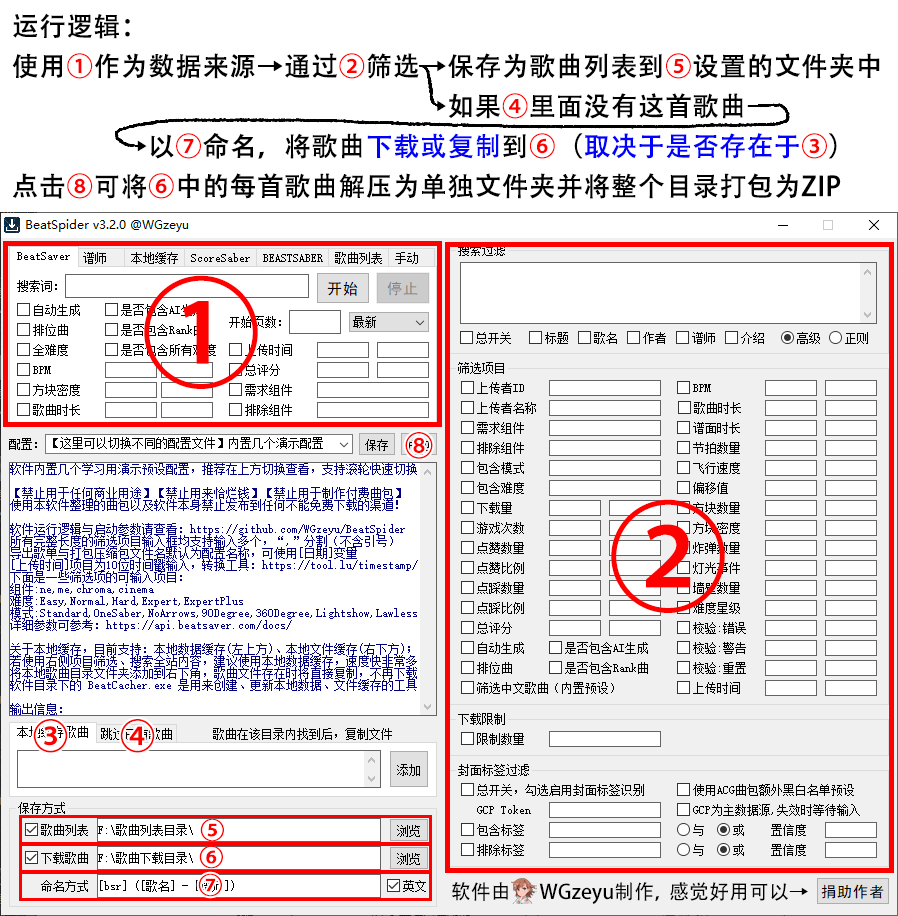

# BeatSpider
BeatSaber的谱面下载软件，可使用多种数据来源、保存方式以及非常多的筛选项来处理歌曲列表、歌曲包。  
  
**下载地址：**[https://github.com/WGzeyu/BeatSpider/releases/latest](https://github.com/WGzeyu/BeatSpider/releases/latest)



## 启动参数
启动参数为高级功能，配合计划任务可以实现每天自动更新曲包。

### BeatSpider
`-config 配置名称` 或 `-c 配置名称`   
从Settings目录下读取指定名称的配置文件（无需加后缀）

`-minimize` 或 `-m`  
窗口以最小化启动

`-local` 或 `-l`  
歌曲详细数据来源切换至本地数据缓存（仅限后四个数据来源）

`-start` 或 `-s`   
启动后自动开始下载

`-unzip` 或 `-u`  
下载完成后解压歌曲目录中的压缩包为文件夹

`-zip` 或 `-z`   
下载完成后解压歌曲目录中的压缩包为文件夹并将歌曲目录打包为zip

`-exit` 或 `-e`   
执行完成后退出软件

示例：  
`读入360度歌曲包`预设，`以最小化运行`，`自动开始下载`，`下载后自动解压`，最后`自动退出`的运行参数为：
```
-config "360度歌曲包" -minimize -start -unzip -exit
```
我推荐的本地曲包自动更新设置方案：  
1. 首先使用我的另一个工具[BSSFM(点击下载)](https://github.com/WGzeyu/Beat-Saber-Song-Folder-Manager/releases/latest)，添加单独的歌曲分类文件夹  
2. 在BeatSpider左下角勾选`下载歌曲`与`跳过已有`，并将这两项的目录都设置为刚才添加的文件夹目录  
3. BeatSpider设置好筛选选项，然后自己设一个配置文件名称，保存配置  
4. 想好自己打算使用的参数，建议按刚才的示例设置，刚才的示例也可以简写为 `-c "配置名称" -m -s -u -e`  
5. 打开`任务计划程序`（可在Win10左下角自带的搜索找到）  
6. 点击左上角的 操作 → 创建基本任务（如果没有创建基本任务，请先点击左侧空白处再点击操作）  
7. 名称和描述：自己看着设  
8. 触发方式：自己看着设  
9. 操作：启动程序  
10. 程序那一栏点击`浏览`，然后找到本软件（BeatSpider.exe）  
11. 添加参数
12. 最后点击完成即可添加，如需详细设置触发方式可双击刚才添加的任务  

### BeatCacher
`-alldata`  
以最小化运行，下载全部信息，完成后退出

`-newdata`  
以最小化运行，只更新新数据，完成后退出

`-songfile`  
以最小化运行，下载歌曲文件，完成后退出

注：BeatCacher只支持使用一个参数，不支持同时使用多参数

## 关于本项目
本软件通过易语言编写，引用了以下模块（均为开源模块）：  
* 精易模块 源码：[http://ec.125.la/](http://ec.125.la/)
* zyJson 源码：[谷歌搜索](https://www.google.com/search?q=%E6%98%93%E8%AF%AD%E8%A8%80+zyjson&nfpr=1) [百度搜索](https://www.baidu.com/s?wd=%E6%98%93%E8%AF%AD%E8%A8%80%20zyjson)

**禁止用于商业用途**
